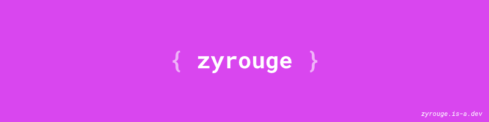

# 👋 Hi there, I am [Zyrouge](https://zyrouge.is-a.dev/)!

-   🔭 I'm currently working: -
-   🌱 I’m currently learning: **[Golang](https://go.dev/)**
-   😄 Pronouns: **zy-rouge**
-   🙃 Fun fact: **I'm a melophine and love philosophy!**

## Languages & Tools

  
⚡ GitHub Stats

  
⚡ GitHub Top langs 

